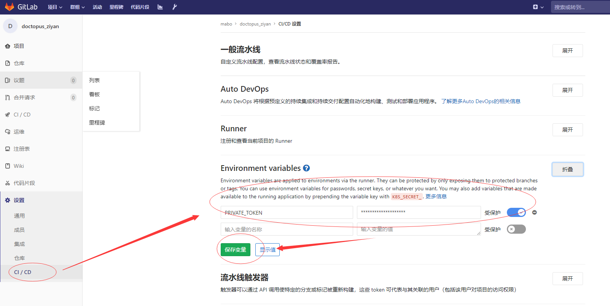

> 官方文档：
>
> https://docs.gitlab.com/ce/ci/README.html
>
> https://docs.gitlab.com.cn/ee/ci/yaml/
>
> 讲道理，这种玩意，无论怎么说都是看官方文档最全面。

# 示例

[官方示例]: https://docs.gitlab.com.cn/ee/ci/examples/README.html
[个人示例]: gitlab项目中，那么多，推荐base_python和avl_5e01_can的示例

# 语法说明

```
stages:
    - build
    - deploy
variables:
    VERSION: 3.7-alpine
    
before_script: 
    - docker login -u $CI_REGISTRY_USER -p $CI_REGISTRY_PASSWORD $CI_REGISTRY
build_job1:
    stage: build
    script:
        - docker load -i python
        - docker tag base_python:latest $CI_REGISTRY_IMAGE:latest
        - docker push $CI_REGISTRY_IMAGE:latest
        - docker rmi $CI_REGISTRY_IMAGE:latest base_python:latest
deploy_job1:
    stage: deploy
    tags :
        - AVL_5E01_Can
    when: manual
    image: $CI_REGISTRY/mabo/base_python:latest
    script:
        # get file trigger_group_ci.py from mabo_group/base_application/ci_interface
        - curl -k -o $NEED_FILE_1 --request GET --header PRIVATE-TOKEN=$CI_JOB_TOKEN $CI_API_V4_URL/projects/$PROJECT_ID_1/repository/files/$NEED_FILE_1/raw?ref=master
        # trigger all project of $GROUP_ID
        - python $NEED_FILE_1 --gitlab_address $GITLAB_ADRESS --private_token $PRIVATE_TOKEN --group_id $GROUP_ID --trigger_decription $CI_PROJECT_NAME   
```

- stages

  用于定义可由作业使用的阶段，并且是全局定义的。

  1. 同一阶段的工作是并行运行的。
  2. 下一阶段的作业在上一阶段的作业成功完成后运行。

- variables

  GitLab CI / CD允许您定义内部变量`.gitlab-ci.yml`，然后在作业环境中传递。它们可以在全局和按作业设置。在`variables`作业级别使用关键字时，它会覆盖全局YAML变量和预定义变量。

  它们存储在Git存储库中，用于存储非敏感项目配置。

  敏感项目的配置，请使用项目(组)变量：

  

- before_script、after_script

  构建前、构建后运行的命令行。

- build_job1、deploy_job1：为具体运行的**job**进行定义

  - stage：表明此job是哪个阶段的

  - script：需要运行那些命令

  - **tags**：表明此job只能在拥有此tag的runner上运行。

  - when：用于表明如何触发，为manual表明，必须手动触发，常用于批量部署。

  - image：使用哪个镜像。默认使用`docker_base`中的镜像。

    默认镜像中包含功能较少，个人增加了curl、docker-compose的功能。如需增加，请自行构建。

    常用：`$CI_REGISTRY/mabo/base_python:latest`（注意自己改路径）

# CI变量

CI有很多默认的变量，

可以查看  [ci参数.sh](ci参数.sh)，进行查看。（反正是我虚拟机的，随便看。）

经历使用这些参数进行CI的编写。如非得已，不要自己复写变量。（要写也请在group中进行变量设定。）

# 闲言碎语

- load镜像

  因为内网环境，这里使用了一个构造CI的技巧，通过直接上传镜像的打包文件，以达成最最基层的镜像保存、维护、更新功能。

- CI的代码库——通过gitlab强大的api功能实现

  虽然CI看似散乱，关联性不强，但并不是说不能造CI库。后续会给出一些键立CI库的实现方式。

  **一段代码，如果超过50行，或者被多次使用，那么请考虑将他包装为函数。**

- 善用CI的变量功能。

  CI的变量功能，可以最大程度降低CI文件的耦合性，甚至一个编写良好的CI文件，就算导入不同的gitlab中，都应该可以良好地运行。

  甚至可以使用其实现对于安全密钥的管理。

- 善用CI的API

  调用API的确不是很方便，但万能的网友，已经给出了良好的解决方案——gitlab-python。

  更何况，本身调用也不是那么复杂。